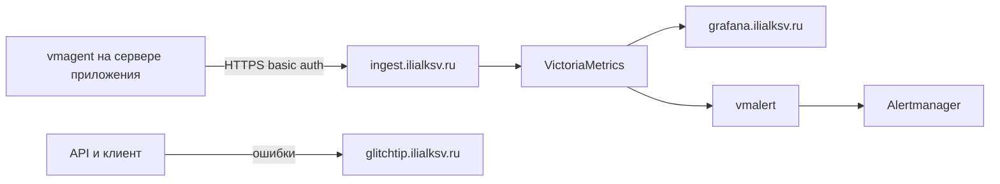

# ilialksv-monitoring

Общий мониторинг для проектов на Dokploy. Стек живёт на отдельной VPS и не знает заранее список приложений. Новый проект подключается метками контейнера. Новый сервер подключается отдельным деплоем агента и переменными окружения.

Панель Dokploy одна: `dokploy.ilialksv.ru`. У каждого deploy-сервера свой Traefik, поэтому A-запись домена указывает на IP сервера, где крутится сервис, а не на IP панели.

## Что где работает

| Сервис | Где | Снаружи |
| --- | --- | --- |
| Grafana, VictoriaMetrics, vmalert, Alertmanager, GlitchTip, vmauth, node_exporter этой VPS | Monitoring VPS | Grafana `:3000`, GlitchTip `:8000`, vmauth `:8427` |
| vmagent + node_exporter | Каждый deploy-сервер с приложениями | Ничего. Метрики уходят на ingest |
| Postgres и Redis приложений | Сервер приложения, сервисы Dokploy | Только внутри `dokploy-network` |

Агент на Monitoring VPS не ставится. Хост этой машины скрейпит сам VictoriaMetrics.



## Домены

Их можно переименовать в Dokploy, если записи ниже не подходят. A-запись каждого имени смотрит на Monitoring VPS.

- `grafana.ilialksv.ru` → Grafana, порт контейнера `3000`
- `glitchtip.ilialksv.ru` → GlitchTip, порт `8000`
- `ingest.ilialksv.ru` → vmauth, порт `8427`

`dokploy.ilialksv.ru` остаётся на VPS панели.

## Как подключить проект

На контейнере, который отдаёт `/metrics`, нужны метки. Пример уже стоит в compose бэкенда Genario.

```yaml
labels:
  monitoring.scrape: "true"
  monitoring.port: "3000"
  monitoring.job: backend
  monitoring.project: genario
  monitoring.env: ${DEPLOY_ENVIRONMENT}
```

`monitoring.job` становится меткой `job` (`backend`, `postgres`, `redis` или своё имя). `monitoring.project` и `monitoring.env` режут дашборды и алерты. Порт — внутренний порт контейнера, не порт хоста.

Центральный `victoriametrics/scrape.yml` при этом не меняется. Агент находит контейнер в `dokploy-network` и шлёт ряды на ingest.

Ошибки заводятся в UI GlitchTip: новый проект, DSN в env приложения. Для frontend Genario DSN вшивается в бандл на сборке (`VITE_GLITCHTIP_DSN`), поэтому смена домена GlitchTip требует нового билда, не только рестарта. У бэкенда `GLITCHTIP_DSN` читается при старте процесса.

Свои графики по нестандартным именам метрик кладутся паком. Папка `packs/genario/` — дашборды и алерты для `genario_http_*`. Postgres, Redis, хост и `up` работают без пака.

## Как подключить сервер

В Dokploy, на нужном deploy-сервере, отдельное Compose-приложение из этого репозитория:

- Compose path: `agent/docker-compose.yml`
- Env из `agent/.env.example`
- `SERVER_NAME` уникален среди серверов, одно слово, например `genario`
- `VMAGENT_REMOTE_WRITE_URL=https://ingest.ilialksv.ru/api/v1/write`
- логин и пароль те же, что `VMAUTH_USERNAME` и `VMAUTH_PASSWORD` центрального стека

Автодеплой агента включается у этого приложения в Dokploy. GitHub Action в корне деплоит только центральный стек: у него один `DOKPLOY_APPLICATION_ID`.

Сокет Docker у агента только на чтение, но это всё равно доступ уровня root на этом сервере. Порты 9100, 9187 и 9121 наружу не публикуются.

`/metrics` бэкенда дополнительно закрыт `METRICS_ALLOWED_IPS`. Туда пишется подсеть `dokploy-network` (`docker network inspect dokploy-network`). Пустой список запрещает всех. Агент ходит в контейнер напрямую, не через Traefik.

Для postgres-exporter в env приложения задаётся `POSTGRES_EXPORTER_DATA_SOURCE_NAME`, отдельно от `POSTGRES_URL`. Если в URL ещё нет query string, добавь `?sslmode=disable`. Если `?` уже есть, добавь `&sslmode=disable`. Дописывать суффикс к `POSTGRES_URL` нельзя: второй `?` ломает строку.

## Runbook переноса Genario

Код этого репозитория и панель готовятся до переключения DNS. Содержимое PostgreSQL переносишь ты. Redis поднимается пустым. История метрик и GlitchTip не переносится.

1. Запушь этот репозиторий в `ilialksv/ilialksv-monitoring`. В Dokploy заведи два deploy-сервера, если их ещё нет: Genario и Monitoring. Панель на них не переезжает.
2. На Monitoring VPS задеплой корневой `docker-compose.yml`. В команде Compose укажи `--force-recreate`, иначе Grafana не подхватит новый JSON с bind mount. Пропиши env из `.env.example`, домены Grafana, GlitchTip и ingest. В GlitchTip заведи проекты API, workers и web. Prod и stage — окружения внутри проекта, не второй инстанс.
3. На Genario VPS создай два Postgres и два Redis в Dokploy. Восстанови дампы PostgreSQL до первого деплоя бэкенда. В дампе уже есть таблица миграций Drizzle, повторный migrate будет пустым. Если migrate успеет создать пустую схему раньше дампа, восстановление придётся разбирать вручную.
4. На этом же сервере создай приложения: backend compose для production и для stage, frontend application для production и для stage. Домены с префиксом `stage.` оставь теми же. В env бэкенда пропиши новые `POSTGRES_URL`, `REDIS_URL`, `POSTGRES_EXPORTER_DATA_SOURCE_NAME`, `METRICS_ALLOWED_IPS` и новый `GLITCHTIP_DSN`.
5. Задеплой агент на Genario VPS. `SERVER_NAME=genario`.
6. Обнови секреты GitHub Environment `production` и `stage`: `DOKPLOY_APPLICATION_ID` новых приложений, `DOKPLOY_URL` по-прежнему `https://dokploy.ilialksv.ru`, секреты GlitchTip и `VITE_GLITCHTIP_DSN`. Запушь frontend, чтобы бандл собрался с новым DSN. Workflow бэкенда и frontend не менялись.
7. Переключи A-записи. Сначала домены `stage.`, потом production. Домены Genario смотрят на IP Genario VPS. Домены мониторинга смотрят на IP Monitoring VPS.
8. Проверь stage, потом production:
   - сайт и API открываются по старым именам;
   - в Grafana, папка Hosts, есть сервер `genario` и сервер `monitoring`;
   - в Datastores есть `project="genario"` для postgres и redis, оба env;
   - в папке Genario запросы backend есть и для production, и для stage;
   - тестовая ошибка клиента и API падает в новый GlitchTip.
9. Выключи старые VPS frontend, backend, баз и старого мониторинга. Дырки в файрволе на 9100, 9187, 9121 и stage-портах больше не нужны.

## Состав репозитория

| Путь | Зачем |
| --- | --- |
| `docker-compose.yml` | Центральный стек |
| `agent/` | Агент для deploy-сервера |
| `victoriametrics/scrape.yml` | Только node_exporter Monitoring VPS |
| `vmauth/config.yml` | Приём remote write |
| `vmalert/rules/alerts.yml` | Общие алерты |
| `packs/genario/` | Дашборды и алерты метрик Genario |
| `grafana/` | Общие дашборды и provisioning |
| `.github/workflows/deploy.yaml` | Деплой центрального стека в Dokploy по push в `main` |

## Проверка конфига

```bash
docker compose --env-file .env.example config
docker compose --env-file agent/.env.example -f agent/docker-compose.yml config
```

Контейнеры этой командой не запускаются.
