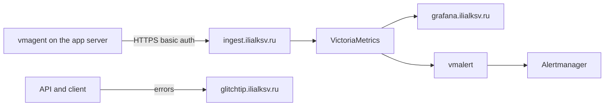

# ilialksv-monitoring

Shared monitoring for projects deployed with Dokploy. The stack runs on its own VPS and does not know the application list in advance. A new project is attached with container labels. A new server is attached by deploying the agent and setting environment variables.

There is one Dokploy panel: `dokploy.ilialksv.ru`. Each deploy server has its own Traefik, so a domain's A record points at the IP of the server that runs the service, not at the panel IP.

## What runs where

| Service | Where | Public |
| --- | --- | --- |
| Grafana, VictoriaMetrics, vmalert, Alertmanager, GlitchTip, vmauth, node_exporter for this VPS | Monitoring VPS | Grafana `:3000`, GlitchTip `:8000`, vmauth `:8427` |
| vmagent + node_exporter | Each deploy server that runs applications | Nothing. Metrics are pushed to ingest |
| Application Postgres and Redis | Application server, Dokploy services | Only inside `dokploy-network` |

Do not install the agent on the monitoring VPS. VictoriaMetrics scrapes that host itself.



## Domains

Rename these in Dokploy if the names below do not fit. Each A record points at the monitoring VPS.

- `grafana.ilialksv.ru` → Grafana, container port `3000`
- `glitchtip.ilialksv.ru` → GlitchTip, port `8000`
- `ingest.ilialksv.ru` → vmauth, port `8427`

`dokploy.ilialksv.ru` stays on the panel VPS.

## Connect a project

A container that serves `/metrics` needs labels. The Genario backend compose already has an example.

```yaml
labels:
  monitoring.scrape: "true"
  monitoring.port: "3000"
  monitoring.job: backend
  monitoring.project: genario
  monitoring.env: ${DEPLOY_ENVIRONMENT}
```

`monitoring.job` becomes the `job` label (`backend`, `postgres`, `redis`, or another name). `monitoring.project` and `monitoring.env` filter dashboards and alerts. The port is the container port, not a host port.

`victoriametrics/scrape.yml` stays unchanged. The agent finds the container on `dokploy-network` and remote-writes the series to ingest.

Errors are registered in the GlitchTip UI: create a project and put the DSN in the application env. The Genario frontend bakes `VITE_GLITCHTIP_DSN` into the bundle at build time, so a GlitchTip domain change needs a new frontend build, not only a restart. The backend reads `GLITCHTIP_DSN` when the process starts.

Custom charts for non-standard metric names live in a pack. `packs/genario/` holds dashboards and alerts for `genario_http_*`. Postgres, Redis, host, and `up` work without a pack.

## Connect a server

In Dokploy, on the target deploy server, create a separate Compose application from this repository:

- Compose path: `agent/docker-compose.yml`
- Env from `agent/.env.example`
- `SERVER_NAME` is unique across servers, one word, for example `genario`
- `VMAGENT_REMOTE_WRITE_URL=https://ingest.ilialksv.ru/api/v1/write`
- Username and password match `VMAUTH_USERNAME` and `VMAUTH_PASSWORD` on the central stack

Turn on auto-deploy for that Dokploy application. The root GitHub Action deploys only the central stack: it has a single `DOKPLOY_APPLICATION_ID`.

The agent mounts the Docker socket read-only. That is still root-equivalent access on this server. Ports 9100, 9187, and 9121 are not published.

Backend `/metrics` is also closed by `METRICS_ALLOWED_IPS`. Set it to the `dokploy-network` subnet (`docker network inspect dokploy-network`). An empty list denies everyone. The agent calls the container directly, not through Traefik.

Set `POSTGRES_EXPORTER_DATA_SOURCE_NAME` in the application env, separate from `POSTGRES_URL`. If the URL has no query string, add `?sslmode=disable`. If it already has `?`, add `&sslmode=disable`. Do not append that suffix to `POSTGRES_URL`: a second `?` breaks the URL.

## Genario move runbook

Prepare this repository and the Dokploy panel before the DNS cutover. You restore the PostgreSQL contents. Redis starts empty. VictoriaMetrics history and GlitchTip events are not migrated.

1. Push this repository to `ilialksv/ilialksv-monitoring`. In Dokploy, add two deploy servers if they are not there yet: Genario and Monitoring. The panel does not move.
2. On the monitoring VPS, deploy the root `docker-compose.yml`. Set the Compose command to `--force-recreate`, or Grafana will not pick up new JSON from the bind mount. Fill env from `.env.example` and attach the Grafana, GlitchTip, and ingest domains. In GlitchTip, create projects for the API, workers, and web. Production and stage are environments inside a project, not a second instance.
3. On the Genario VPS, create two Postgres services and two Redis services in Dokploy. Restore the PostgreSQL dumps before the first backend deploy. The dump already contains the Drizzle migrations table, so a later migrate is a no-op. If migrate creates an empty schema before the restore, the restore has to be untangled by hand.
4. On that same server, create the applications: backend compose for production and for stage, frontend application for production and for stage. Keep the existing `stage.` domain prefix. In the backend env, set the new `POSTGRES_URL`, `REDIS_URL`, `POSTGRES_EXPORTER_DATA_SOURCE_NAME`, `METRICS_ALLOWED_IPS`, and `GLITCHTIP_DSN`.
5. Deploy the agent on the Genario VPS. `SERVER_NAME=genario`.
6. Update the GitHub Environment secrets for `production` and `stage`: `DOKPLOY_APPLICATION_ID` of the new applications, `DOKPLOY_URL` still `https://dokploy.ilialksv.ru`, the GlitchTip secrets, and `VITE_GLITCHTIP_DSN`. Push the frontend so the bundle is built with the new DSN. The backend and frontend workflows are unchanged.
7. Switch A records. `stage.` domains first, then production. Genario domains point at the Genario VPS IP. Monitoring domains point at the monitoring VPS IP.
8. Check stage, then production:
   - the site and API open on the existing hostnames;
   - Grafana, Hosts folder, shows servers `genario` and `monitoring`;
   - Datastores shows `project="genario"` for postgres and redis, both envs;
   - the Genario folder shows backend traffic for production and stage;
   - a test client error and an API error land in the new GlitchTip.
9. Turn off the old frontend, backend, database, and monitoring VPS. Firewall holes on 9100, 9187, 9121, and the stage ports are no longer needed.

## Repository map

| Path | Purpose |
| --- | --- |
| `docker-compose.yml` | Central stack |
| `agent/` | Agent for a deploy server |
| `victoriametrics/scrape.yml` | node_exporter on the monitoring VPS only |
| `vmauth/config.yml` | Remote-write ingress |
| `vmalert/rules/alerts.yml` | Generic alerts |
| `packs/genario/` | Genario metric dashboards and alerts |
| `grafana/` | Shared dashboards and provisioning |
| `.github/workflows/deploy.yaml` | Deploy the central stack to Dokploy on push to `main` |

## Config check

```bash
docker compose --env-file .env.example config
docker compose --env-file agent/.env.example -f agent/docker-compose.yml config
```

These commands do not start containers.
